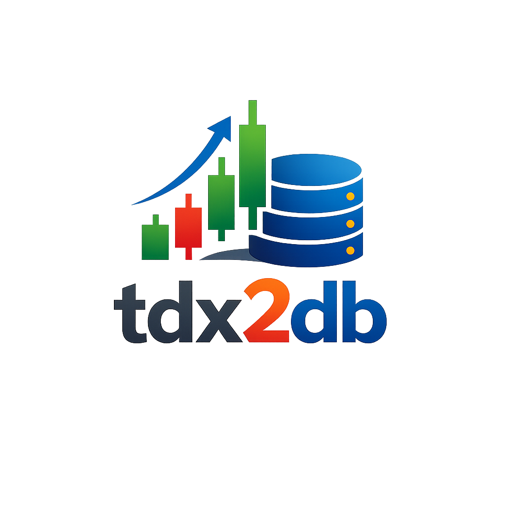

<p align="center">

</p>

# tdx2db - 获得专属的 A 股行情数据库

[](https://github.com/jing2uo/tdx2db/releases)
[](LICENSE)

将通达信行情数据导入本地数据库，支持 DuckDB 和 ClickHouse。

## 亮点

- **增量更新**：日线 / 股本变迁 / 假期日历一条 `cron` 命令搞定
- **分时数据**：可选导入 1 分钟分时
- **复权与衍生**：自动计算后复权因子、前收盘价、换手率、市值
- **在线数据**：基于 opentdx 协议拉取在线代码名称 + 板块 / 概念 / 行业
- **稳定可靠**：基于通达信公开数据，无需收费或限流接口

## 声明

- 代码不兼容历史版本，可能写出 bug，请自行检查数据正确性。
- 导入分时后请保留原始数据并定期备份，日线可快速重建，分时不行。
- 使用问题欢迎来 [Telegram](https://t.me/tdx2db) 讨论。

## 安装

### 二进制

从 [releases](https://github.com/jing2uo/tdx2db/releases) 下载对应平台压缩包，解压后：

```bash
sudo mv tdx2db /usr/local/bin/ && tdx2db -h
```

提供 Linux (amd64/arm64)、macOS (arm64)、Windows (amd64) 预编译版本。Windows / macOS 会跳过 1 分钟分时数据的下载与导入，日线正常处理。

## 使用

### 初始化

首次需全量导入历史数据，从[通达信券商数据](https://www.tdx.com.cn/article/vipdata.html)下载 **沪深京日线数据完整包**：

```shell
# Linux / macOS
mkdir -p vipdoc
wget https://data.tdx.com.cn/vipdoc/hsjday.zip && unzip -q hsjday.zip -d vipdoc

# 若解压后文件名形如 sh\lday\sh000001.day，可批量重命名：
# cd vipdoc && for f in *.day; do mv "$f" "${f##*\\}"; done

# Windows PowerShell
Invoke-WebRequest -Uri "https://data.tdx.com.cn/vipdoc/hsjday.zip" -OutFile "hsjday.zip"
Expand-Archive -Path "hsjday.zip" -DestinationPath "vipdoc" -Force
```

导入：

```shell
# DuckDB:     duckdb://[path]
tdx2db init --dburi 'duckdb://./tdx.db' --dayfiledir ./vipdoc

# ClickHouse: clickhouse://[user[:password]@][host][:port][/database][?http_port=...]
# 默认值: user=default, password="", port=9000, http_port=8123, database=default
tdx2db init --dburi 'clickhouse://localhost' --dayfiledir ./vipdoc
```

### 增量更新

`cron` 会把日线、股本变迁、假期日历、在线代码名称 / 板块更新到最新，并重算前收盘价与复权因子。初次 `init` 后请立刻执行一次。

```bash
tdx2db cron --dburi 'duckdb://tdx.db'

# 加 --min 才会下载并导入 1 分钟分时
tdx2db cron --dburi 'duckdb://tdx.db' --min
```

**分时注意事项**

1. 分时数据下载和导入耗时，表数据量大
2. 通达信不提供历史分时数据，请自行检索后导入
3. 分时更新间隔超过 30 天时，需手动补齐后才能继续
4. 股票代码变更不会处理历史记录

### 全局 flag

- `--temp <dir>`：临时文件父目录，留空走 `$TMPDIR`
- `-v / version`：打印版本（本地 build 与 release 对齐）

## 表与视图

`raw_` 前缀为基础数据，`v_` 前缀为视图。

| 表 / 视图               | 说明                              |
| :---------------------- | :-------------------------------- |
| `_meta`                 | schema 版本等元信息 (当前 v5.0)   |
| `raw_kline_daily`       | 日线 (股票 / 指数 / ETF / 板块)   |
| `raw_kline_1min`        | 1 分钟 K 线                       |
| `raw_basic_daily`       | 股票 / ETF 前收盘价、换手率与市值 |
| `raw_adjust_factor`     | 后复权因子                        |
| `raw_gbbq`              | 股本变迁                          |
| `raw_holidays`          | 假期日历                          |
| `raw_symbol_class`      | 品种分类 (stock/index/etf/...)    |
| `raw_symbol_name`       | 在线代码名称                      |
| `raw_tdx_blocks_info`   | 在线板块 / 概念 / 行业信息        |
| `raw_tdx_blocks_member` | 板块成分关系                      |
| `v_stock_{bfq,qfq,hfq}` | 股票 不复权 / 前复权 / 后复权日线 |
| `v_etf_{bfq,qfq,hfq}`   | ETF 不复权 / 前复权 / 后复权日线  |

视图按 `v_<class>_<fq>` 命名，便于 tab-complete 按归属浏览。股票价格 ROUND 2 位、ETF ROUND 3 位。

```sql
-- 股票前复权
select * from v_stock_qfq where symbol='sz000001' order by date;

-- ETF 后复权
select * from v_etf_hfq where symbol='sh510300' order by date;
```

复权算法来自 QUANTAXIS，原理参考[这里](https://www.yuque.com/zhoujiping/programming/eb17548458c94bc7c14310f5b38cf25c#djL6L)。后复权结果和 QUANTAXIS、通达信等比复权一致；前复权结果和雪球、新浪也一致。


## 致谢

- 在线代码名称、板块 / 行业 / 概念数据的协议处理与解析逻辑，参考并转写自 [opentdx](https://github.com/LisonEvf/opentdx)，让 tdx2db 能以 Go 版本接入这部分在线数据。
- Windows 和 macOS 下的日线合并由 [@Abelonx](https://github.com/Abelonx) 在 [#60](https://github.com/jing2uo/tdx2db/pull/60) 贡献的 native Go 实现支持，让 tdx2db 摆脱了对 Linux datatool 二进制的依赖。

## 欢迎 issue 和 pr

有任何使用问题都可以开 issue 讨论，也期待 pr~
